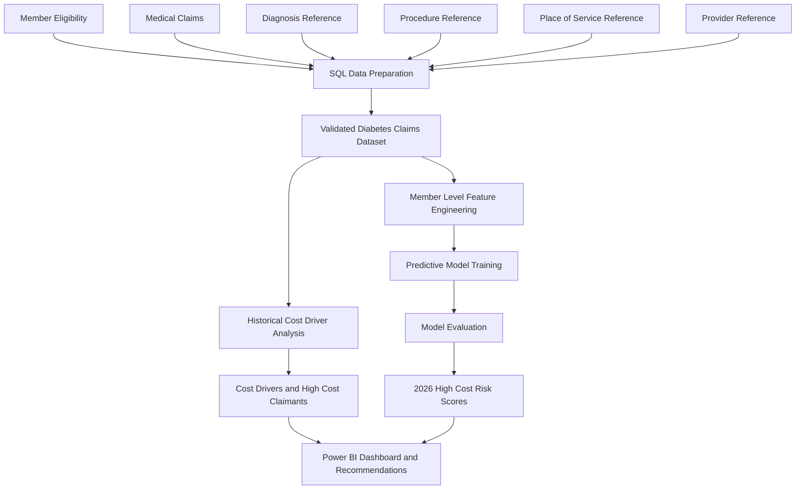

# AI-Assisted Diabetes Cost and High-Cost Claimant Analytics

## Business Problem
The 2025 year-end report showed that diabetes spending increased by 20% compared with 2024. However, the report did not explain whether the increase was caused by inpatient, outpatient, or professional claims. The organization needs to identify high-cost claimants and understand which members contributed most to the increase.

## Key Business Questions
1. How did total diabetes-related spending change between 2024 and 2025?
2. Was the increase driven primarily by inpatient, outpatient, or professional claims?
3. List members who contributed to the increase the most?
4. How was the increase distributed among high-claimants?
5. Which diagnoses, procedures, or places of service generated the additional spending?
6. Which members are most likely to become high-cost diabetes claimants in 2026?

## Project Architecture
This project combines historical data from 2024 and 2025 to identify the members and services that contributed to the increase in diabetes-related spending and predict which members may become high-cost claimants in 2026.

## Dataset
This project uses a synthetic healthcare claims database representing member eligibility and medical claims from 2024 through 2025. It contains no real patient information, and any resemblance to real individuals or claims is coincidental. The dataset was designed to simulate a 23% increase in diabetes-related spending.

### Dataset Files

1. `member_eligibility.csv` - Contains demographic, subscriber relationship, and coverage-period information for each member included in the analysis.
2. `medical_claims.csv` - Contains one record per medical claim service line, including claim identifiers, dates of service and payment, paid and allowed amounts, claim type, and clinical reference codes.
3. `diagnosis_reference.csv` - Contains descriptions and clinical categories for diagnosis codes, including an indicator identifying diabetes-related diagnoses.
4. `procedure_reference.csv` - 
5. `place_of_service_reference.csv`
6. `provider_reference.csv`

CLM_NUM, CLM_LINE_NUM, MEMBER_ID, DOS, PAID_DT, PAID_AMT, ALLOWED_AMT, CLAIM_TYPE, CLM_STATUS

MDC, LN_DIAG, POS, PROVIDER_ID

DIAG_CODE
DIAG_DESCRIPTION
DIAG_CATEGORY
DIABETES_FLAG

## Data Model

## SQL Data Preparation

## Historical Cost-Driver Analysis

## Member-Level Feature Engineering

## Predictive Modeling

## Model Evaluation

## Power BI Dashboard

## Findings and Recommendations

## Limitations and Responsible AI
